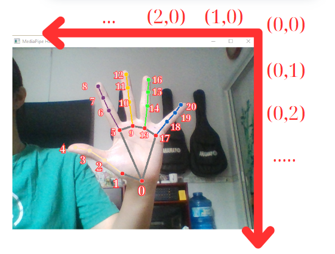

#Game Tetris điều khiển bằng cử chỉ tay
Sử dụng thư viện Medipipe Hand để điều khiền và dùng Uniy để xây dựng trò chơi Tetris
<table>
  <tr>
    <td align="center">
      
       Trang onboarding
    </td>
    <td align="center">
      
       Danh sách công thức
    </td>
  </tr>
</table>
